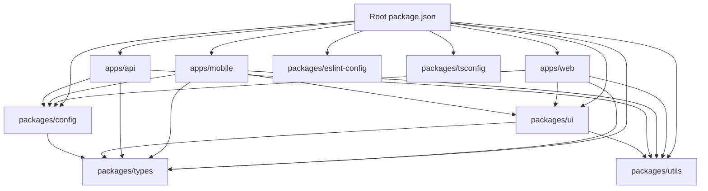

# Upward TurboRepo Monorepo Setup

## Purpose

This document defines the production-grade monorepo setup for Upward using TurboRepo, pnpm, TypeScript, React, React Native + Expo, NestJS, Prisma, and PostgreSQL.

The goal is to keep the repo scalable, strict, and pleasant to work in without over-engineering the first release.

## Source-of-Truth Alignment

This setup follows the existing architecture, roadmap, and database documents:

- Modular monolith backend for the initial phase.
- Shared contracts and strict typing across web, mobile, and API.
- PostgreSQL and Prisma as the data foundation.
- Offline-first and analytics-ready design.
- Solo-developer friendly implementation sequencing.

Important refinement:

- The initial monorepo focuses on `apps/web`, `apps/mobile`, and `apps/api`, plus the shared `packages/ui`, `packages/design-tokens`, `packages/types`, `packages/utils`, and `packages/config` workspaces.
- A separate worker app can be added later if background job volume justifies it.
- Prisma stays inside `apps/api` until there is a second backend process that truly needs direct database access.

This keeps the setup lean while preserving a clean expansion path.

## Final Folder Structure

```text
Upward/
  apps/
    web/
      src/
      public/
      index.html
      package.json
      tsconfig.json
      vite.config.ts
    mobile/
      app/
      src/
      assets/
      package.json
      tsconfig.json
      app.json
      metro.config.js
    api/
      prisma/
        schema.prisma
        migrations/
      src/
      test/
      package.json
      tsconfig.json
      nest-cli.json
  packages/
    design-tokens/
      src/
      package.json
      tsconfig.json
    ui/
      src/
      package.json
      tsconfig.json
    types/
      src/
      package.json
      tsconfig.json
    utils/
      src/
      package.json
      tsconfig.json
    config/
      src/
      package.json
      tsconfig.json
    eslint-config/
      base.cjs
      react.cjs
      node.cjs
      package.json
    tsconfig/
      base.json
      web.json
      mobile.json
      node.json
      package.json
  docs/
    architecture/
    prd/
    api/
    db/
    decisions/
  package.json
  pnpm-workspace.yaml
  turbo.json
  tsconfig.json
  .eslintrc.cjs
  .prettierrc.json
  .prettierignore
  .env.example
  .gitignore
  README.md
```

## Core Monorepo Principles

- Shared code lives in packages, not in app folders.
- Apps depend on packages, not the other way around.
- `packages/design-tokens` is the single source for visual values.
- Business/domain types should be shared through `packages/types`.
- Platform-specific UI should stay in the app unless it is genuinely reusable.
- The API owns Prisma and database migrations in v1.
- All tooling must be strict and consistent across the repo.
- Every workspace package should expose a single public entrypoint.

## Root Package JSON

The root package file should act as the orchestration entrypoint for the repo.

```json
{
  "name": "upward",
  "private": true,
  "packageManager": "pnpm@10.0.0",
  "engines": {
    "node": ">=20.0.0",
    "pnpm": ">=10.0.0"
  },
  "scripts": {
    "dev": "turbo run dev --parallel",
    "dev:web": "pnpm --filter @upward/web dev",
    "dev:mobile": "pnpm --filter @upward/mobile dev",
    "dev:api": "pnpm --filter @upward/api dev",
    "build": "turbo run build",
    "lint": "turbo run lint",
    "typecheck": "turbo run typecheck",
    "test": "turbo run test",
    "format": "prettier --write .",
    "format:check": "prettier --check .",
    "clean": "turbo run clean && rimraf .turbo **/dist **/.expo **/build",
    "db:generate": "pnpm --filter @upward/api prisma generate",
    "db:migrate": "pnpm --filter @upward/api prisma migrate dev",
    "db:studio": "pnpm --filter @upward/api prisma studio",
    "prepare": "husky"
  },
  "devDependencies": {
    "@types/node": "^22.0.0",
    "@typescript-eslint/eslint-plugin": "^8.0.0",
    "@typescript-eslint/parser": "^8.0.0",
    "eslint": "^9.0.0",
    "eslint-config-prettier": "^9.0.0",
    "eslint-plugin-import": "^2.0.0",
    "eslint-plugin-react": "^7.0.0",
    "eslint-plugin-react-hooks": "^5.0.0",
    "husky": "^9.0.0",
    "lint-staged": "^15.0.0",
    "prettier": "^3.0.0",
    "rimraf": "^6.0.0",
    "turbo": "^2.0.0",
    "typescript": "^5.0.0"
  }
}
```

### Why this shape

- Root scripts stay simple and predictable.
- Turbo controls task orchestration.
- Prisma commands are proxied through the API package so ownership is clear.
- Formatting and linting are available at the root for developer convenience.
- `prepare` supports Husky without extra manual steps.

## pnpm Workspace Configuration

```yaml
packages:
  - "apps/*"
  - "packages/*"
```

### Why pnpm

- Fast installs and strong workspace linking.
- Good disk efficiency for a multi-package repo.
- Clear package boundary enforcement.
- Better ergonomics than ad hoc local linking.

## TurboRepo Configuration

Use the modern Turbo task model with caching for shared tasks.

```json
{
  "$schema": "https://turbo.build/schema.json",
  "globalDependencies": [
    ".env.example",
    ".eslintrc.cjs",
    ".prettierrc.json",
    "pnpm-workspace.yaml",
    "tsconfig.json",
    "turbo.json"
  ],
  "tasks": {
    "build": {
      "dependsOn": ["^build"],
      "outputs": ["dist/**", "build/**", ".expo/**"]
    },
    "dev": {
      "cache": false,
      "persistent": true
    },
    "lint": {
      "dependsOn": ["^lint"],
      "outputs": []
    },
    "typecheck": {
      "dependsOn": ["^typecheck"],
      "outputs": []
    },
    "test": {
      "dependsOn": ["^test"],
      "outputs": ["coverage/**"]
    },
    "clean": {
      "cache": false
    }
  }
}
```

### Turbo design rules

- `build` is cacheable and recursive.
- `dev` is never cached and stays persistent.
- `lint`, `typecheck`, and `test` are cached when inputs are unchanged.
- Output directories are explicit so cache invalidation is predictable.
- `.env.example` is tracked as a global dependency so environment changes are visible.

## Root TypeScript Setup

The root `tsconfig.json` should reference the shared tsconfig package and the workspace projects.

```json
{
  "files": [],
  "references": [
    { "path": "packages/tsconfig" },
    { "path": "packages/design-tokens" },
    { "path": "packages/types" },
    { "path": "packages/utils" },
    { "path": "packages/config" },
    { "path": "packages/ui" },
    { "path": "apps/web" },
    { "path": "apps/mobile" },
    { "path": "apps/api" }
  ]
}
```

### Root TypeScript policy

- Use project references for scalable typecheck behavior.
- Keep strict mode on everywhere.
- Avoid `any`.
- Prefer explicit module boundaries over ambient globals.

## Shared TSConfig Package

The shared tsconfig package should centralize compiler settings so every app and package stays aligned.

### `packages/tsconfig/package.json`

```json
{
  "name": "@upward/tsconfig",
  "version": "0.0.0",
  "private": true,
  "files": ["*.json"],
  "license": "UNLICENSED"
}
```

### `packages/tsconfig/base.json`

```json
{
  "$schema": "https://json.schemastore.org/tsconfig",
  "compilerOptions": {
    "target": "ES2023",
    "module": "ESNext",
    "moduleResolution": "Bundler",
    "strict": true,
    "noUncheckedIndexedAccess": true,
    "exactOptionalPropertyTypes": true,
    "noImplicitOverride": true,
    "noPropertyAccessFromIndexSignature": true,
    "forceConsistentCasingInFileNames": true,
    "skipLibCheck": true,
    "verbatimModuleSyntax": true,
    "resolveJsonModule": true,
    "useDefineForClassFields": true,
    "declaration": true,
    "declarationMap": true,
    "sourceMap": true,
    "incremental": true,
    "composite": true,
    "baseUrl": ".",
    "paths": {
      "@upward/types": ["../types/src/index.ts"],
      "@upward/types/*": ["../types/src/*"],
      "@upward/ui": ["../ui/src/index.ts"],
      "@upward/ui/*": ["../ui/src/*"],
      "@upward/utils": ["../utils/src/index.ts"],
      "@upward/utils/*": ["../utils/src/*"],
      "@upward/config": ["../config/src/index.ts"],
      "@upward/config/*": ["../config/src/*"]
    }
  }
}
```

### `packages/tsconfig/web.json`

```json
{
  "extends": "./base.json",
  "compilerOptions": {
    "lib": ["ES2023", "DOM", "DOM.Iterable"],
    "jsx": "react-jsx",
    "types": ["vite/client"]
  }
}
```

### `packages/tsconfig/mobile.json`

```json
{
  "extends": "./base.json",
  "compilerOptions": {
    "lib": ["ES2023"],
    "jsx": "react-jsx",
    "types": ["react", "react-native"]
  }
}
```

### `packages/tsconfig/node.json`

```json
{
  "extends": "./base.json",
  "compilerOptions": {
    "module": "NodeNext",
    "moduleResolution": "NodeNext",
    "lib": ["ES2023"],
    "types": ["node"]
  }
}
```

### Why a tsconfig package

- Every workspace uses the same strictness.
- Type settings stay centralized.
- App-specific target differences remain explicit.
- No one-off compiler drift across apps.

## ESLint Configuration

The ESLint setup should be layered so root rules are shared and app-specific rules can be extended cleanly.

### `packages/eslint-config/package.json`

```json
{
  "name": "@upward/eslint-config",
  "version": "0.0.0",
  "private": true,
  "files": ["*.cjs"],
  "license": "UNLICENSED"
}
```

### `packages/eslint-config/base.cjs`

```js
module.exports = {
  root: false,
  env: {
    es2023: true
  },
  parser: "@typescript-eslint/parser",
  parserOptions: {
    ecmaVersion: "latest",
    sourceType: "module"
  },
  plugins: ["@typescript-eslint", "import"],
  extends: [
    "eslint:recommended",
    "plugin:@typescript-eslint/recommended",
    "plugin:import/recommended",
    "plugin:import/typescript",
    "prettier"
  ],
  rules: {
    "@typescript-eslint/no-explicit-any": "error",
    "@typescript-eslint/consistent-type-imports": "error",
    "@typescript-eslint/no-unused-vars": ["error", { "argsIgnorePattern": "^_" }],
    "import/order": [
      "error",
      {
        "groups": ["builtin", "external", "internal", "parent", "sibling", "index"],
        "newlines-between": "always",
        "alphabetize": {
          "order": "asc",
          "caseInsensitive": true
        }
      }
    ]
  }
};
```

### `packages/eslint-config/react.cjs`

```js
module.exports = {
  extends: ["./base.cjs", "plugin:react/recommended", "plugin:react-hooks/recommended"],
  settings: {
    react: {
      version: "detect"
    }
  },
  rules: {
    "react/react-in-jsx-scope": "off"
  }
};
```

### `packages/eslint-config/node.cjs`

```js
module.exports = {
  extends: ["./base.cjs"],
  env: {
    node: true
  }
};
```

### Root `.eslintrc.cjs`

```js
module.exports = {
  root: true,
  ignorePatterns: ["dist", "build", ".expo", ".turbo", "coverage", "node_modules"],
  overrides: [
    {
      files: ["**/*.{ts,tsx}"],
      extends: ["@upward/eslint-config/base"]
    },
    {
      files: ["apps/web/**/*.{ts,tsx}"],
      extends: ["@upward/eslint-config/react"]
    },
    {
      files: ["apps/mobile/**/*.{ts,tsx}"],
      extends: ["@upward/eslint-config/react"]
    },
    {
      files: ["apps/api/**/*.{ts,tsx}", "packages/**/*.{ts,tsx}"],
      extends: ["@upward/eslint-config/node"]
    }
  ]
};
```

### Why this ESLint shape works

- Shared rules live once.
- Web and mobile get React-specific behavior.
- API and packages keep Node-appropriate linting.
- `no-any` is enforced everywhere.
- Import ordering stays consistent across the workspace.

## Prettier Configuration

### `.prettierrc.json`

```json
{
  "semi": true,
  "singleQuote": true,
  "trailingComma": "all",
  "printWidth": 100,
  "tabWidth": 2,
  "arrowParens": "always"
}
```

### `.prettierignore`

```text
node_modules
.turbo
dist
build
coverage
.expo
pnpm-lock.yaml
```

### Recommended formatting policy

- Prettier owns formatting.
- ESLint owns correctness.
- Do not overlap responsibilities.
- Keep Tailwind class sorting deterministic if the team adopts a Tailwind Prettier plugin later.

## Shared Types Package Setup

`packages/types` should be the single shared source for types used by web, mobile, and API.

### UI Responsibilities

- Cross-platform domain types.
- API request and response types.
- DTOs and command/query shapes.
- Sync envelopes and offline metadata.
- Shared enums and union types.
- Analytics metric keys and payload shapes.

### UI Package Structure

```text
packages/types/
  src/
    api/
    auth/
    domain/
    sync/
    analytics/
    index.ts
  package.json
  tsconfig.json
```

### Package rules

- No framework imports.
- No database client imports.
- No React imports.
- No runtime side effects.
- Keep the package safe to consume from any workspace.

### Recommended exports

- `@upward/types/api`
- `@upward/types/auth`
- `@upward/types/domain`
- `@upward/types/sync`
- `@upward/types/analytics`

### Why not create more contract packages now

The setup is cleaner if one package owns the shared type surface. That avoids fragmentation before the product has enough complexity to justify narrower contract packages.

## Shared UI Package Setup

`packages/ui` should contain reusable design-system primitives, not whole app screens.

### Utilities Responsibilities

- Shared buttons, inputs, cards, sheets, dialogs, forms, badges, loaders, and empty states.
- Cross-platform layout primitives where feasible.
- Visual tokens and component-level styling helpers.
- Reusable UI patterns that are truly common to web and mobile.

### Utilities Package Structure

```text
packages/ui/
  src/
    components/
    primitives/
    forms/
    feedback/
    data-display/
    hooks/
    index.ts
  package.json
  tsconfig.json
```

### UI package rules

- Keep business logic out.
- Keep app navigation out.
- Prefer small composable primitives.
- Use platform-specific entry points only when necessary.
- Do not force identical rendering behavior across web and mobile if the platform needs differ.

### Recommended dependency boundaries

- May depend on `@upward/types` and `@upward/utils`.
- Should not depend on app packages.
- Should not depend on Prisma or NestJS.

## Utilities Package Setup

`packages/utils` should contain pure helper logic that is safe everywhere.

### Responsibilities

- Date and time helpers.
- String normalization.
- Number formatting and clamping.
- Array and object helpers.
- ID and key helpers.
- Pagination helpers.
- Generic business-safe utilities that are not tied to a domain package.

### Recommended package structure

```text
packages/utils/
  src/
    date/
    string/
    number/
    array/
    object/
    pagination/
    index.ts
  package.json
  tsconfig.json
```

### Utilities package rules

- No framework imports.
- No environment access.
- No side effects.
- No hidden mutable state.
- Keep it small and curated.

## Environment Variable Strategy

The environment strategy should be strict, explicit, and app-scoped.

### Principles

- Commit `.env.example`.
- Never commit secrets.
- Validate env vars at startup.
- Keep server-only and client-exposed variables separate.
- Use the config package as the single typed access layer.

### Files

- `.env.example` at the repo root.
- `.env.local` for developer machine secrets.
- `.env.development`, `.env.test`, `.env.production` when needed.
- App-specific env files only if a platform requires them.

### Prefix strategy

- `apps/web`: `VITE_` prefixed values only for client exposure.
- `apps/mobile`: `EXPO_PUBLIC_` prefixed values only for client exposure.
- `apps/api`: no public prefix; all server secrets stay server-side.

### Example environment groups

- Shared: `NODE_ENV`, `APP_ENV`, `LOG_LEVEL`
- API: `DATABASE_URL`, `JWT_ACCESS_SECRET`, `JWT_REFRESH_SECRET`, `CORS_ORIGIN`
- Web: `VITE_API_URL`, `VITE_APP_NAME`
- Mobile: `EXPO_PUBLIC_API_URL`, `EXPO_PUBLIC_APP_SCHEME`

### Config package behavior

- Parse, normalize, and validate variables in one place.
- Export typed config objects.
- Fail fast during boot if a required variable is missing.
- Keep env access out of feature code.

## Path Alias Strategy

The alias strategy should be boring and consistent across the whole repo.

### Workspace aliases

- `@upward/types`
- `@upward/ui`
- `@upward/utils`
- `@upward/config`

### App-local aliases

- `@/` maps to each app’s local `src/` directory.
- `#root/` can be used sparingly if a root-level alias is needed, but only if it clearly improves maintainability.

### Rules

- Never deep-import from package internals.
- Always export from a package root entrypoint.
- Keep TypeScript path aliases aligned with runtime resolution in Vite, Metro, and Nest.
- Mirror aliases in all tools that resolve modules.

### Runtime compatibility notes

- Web: Vite alias config should mirror TS paths.
- Mobile: Metro or Expo alias config should mirror TS paths.
- API: NestJS should resolve paths either through TS path mapping at build time or a runtime path helper if needed.

## Recommended Scripts by Workspace

### Root scripts

- `dev`: run all active development tasks in parallel.
- `build`: build all packages and apps in dependency order.
- `lint`: lint the whole workspace.
- `typecheck`: run TypeScript checks across the workspace.
- `test`: run all tests.
- `format`: format the repo.
- `clean`: remove generated artifacts.
- `db:*`: forward Prisma commands through the API package.

### App scripts

#### Web

- `dev`
- `build`
- `preview`
- `lint`
- `typecheck`
- `test`

#### Mobile

- `dev`
- `android`
- `ios`
- `web`
- `lint`
- `typecheck`
- `test`

#### API

- `dev`
- `build`
- `start`
- `lint`
- `typecheck`
- `test`
- `prisma:generate`
- `prisma:migrate`
- `prisma:studio`

### Package scripts

- `build`
- `lint`
- `typecheck`
- `test`
- `clean`

## Monorepo Dependency Graph



### Graph rules

- Apps may depend on packages.
- Packages may depend on smaller utility packages where necessary.
- No package may depend on an app.
- The `types` package sits at the center of the shared contract surface.
- The `ui` package stays reusable and platform-aware, not app-aware.

## Local Development Workflow

### Recommended boot order

1. Install dependencies.
2. Generate Prisma client from `apps/api`.
3. Start the API.
4. Start the web app.
5. Start the mobile app.
6. Run typecheck and lint in parallel while coding.

### Daily loop

- Keep the API running while editing shared types.
- Keep the web app open for fast UI validation.
- Use the mobile app for capture and sync testing.
- Run `turbo run typecheck lint` before large merges.

### Practical solo-dev workflow

- Work in feature branches.
- Keep commits small.
- Use package boundaries to avoid accidental coupling.
- Prefer `pnpm --filter` for targeted work.
- Use `turbo` to avoid rerunning unchanged tasks.

## Build Pipeline Strategy

### Local build pipeline

1. Typecheck shared packages.
2. Build shared packages.
3. Build API.
4. Build web.
5. Validate mobile bundling.
6. Run tests.

### CI build pipeline

1. Install with frozen lockfile.
2. Lint and typecheck.
3. Build affected packages.
4. Run API tests.
5. Run web and mobile validation.
6. Publish only affected artifacts.

### Build order rule

- Build shared packages first because they are the dependency root for every app.
- Build API before web/mobile if it is the source of typed contracts.
- Keep build outputs deterministic so Turbo cache hits remain reliable.

## Caching Strategy

### Turbo cache

- Cache all deterministic tasks.
- Keep `dev` uncached.
- Define outputs explicitly for each task.
- Avoid changing task output paths unless necessary.

### Cache-friendly design

- Split shared packages cleanly.
- Keep generated files out of source folders.
- Avoid tasks that write into unknown directories.
- Make environment inputs explicit.

### Suggested cache outputs

- Build outputs: `dist/**`, `build/**`, `.expo/**`
- Test outputs: `coverage/**`
- Typecheck and lint: no outputs, only cached task hashes

### Remote caching

- Enable Turbo remote cache in CI when the repo reaches sustained usage.
- Keep cache keys deterministic.
- Use branch-aware cache policies so feature work benefits without polluting release builds.

## CI/CD Considerations

### CI expectations

- Use GitHub Actions or an equivalent CI system.
- Install via `pnpm install --frozen-lockfile`.
- Run lint, typecheck, and tests before build or deploy.
- Cache pnpm store and Turbo cache.
- Use path filters or Turbo affected scopes to avoid full-repo work when only one app changed.

### Deployment notes

- Web can be deployed independently.
- API should deploy with database migration safety checks.
- Mobile release can be decoupled through Expo/EAS or an equivalent delivery pipeline.
- Secrets should come from the CI provider or deployment environment, not the repo.
- Promotion should be artifact-based, not rebuild-based, when possible.

### Prisma and deployment

- Generate Prisma client as part of API build or prebuild.
- Apply migrations in a controlled step.
- Never couple destructive schema changes to a front-end deployment.

### Branching and preview environments

- Feature branches should get preview checks where practical.
- Web preview deployments are high value.
- API preview environments are useful if the infrastructure is available.
- Mobile previews should focus on build validation rather than a full deployment cycle early on.

## Exact Commands to Initialize the Monorepo

### 1. Create the repo and folders

```bash
mkdir Upward
cd Upward
git init
pnpm init
mkdir apps packages docs
mkdir apps/web apps/mobile apps/api
mkdir packages/ui packages/types packages/utils packages/config packages/eslint-config packages/tsconfig
```

### 2. Install root tooling

```bash
pnpm add -D turbo typescript eslint prettier husky lint-staged rimraf @types/node @typescript-eslint/parser @typescript-eslint/eslint-plugin eslint-config-prettier eslint-plugin-import eslint-plugin-react eslint-plugin-react-hooks
```

### 3. Install package and app dependencies

```bash
pnpm add -F @upward/web react react-dom
pnpm add -F @upward/web -D vite @vitejs/plugin-react

pnpm add -F @upward/mobile react react-native expo
pnpm add -F @upward/mobile -D @expo/metro-config

pnpm add -F @upward/api @nestjs/common @nestjs/core @nestjs/platform-express reflect-metadata rxjs
pnpm add -F @upward/api prisma @prisma/client
pnpm add -F @upward/api -D @nestjs/cli
```

### 4. Create configuration files

```bash
# create package.json files for apps and packages
# create pnpm-workspace.yaml
# create turbo.json
# create tsconfig.json
# create .eslintrc.cjs
# create .prettierrc.json
# create .prettierignore
# create .env.example
```

### 5. Bootstrap Prisma and app shells

```bash
pnpm --filter @upward/api prisma init
pnpm --filter @upward/api prisma generate
pnpm --filter @upward/web dev
pnpm --filter @upward/mobile dev
pnpm --filter @upward/api dev
```

## Installation Order

The most reliable install order for a solo developer is:

1. Root tooling and workspace manager.
2. Shared config packages.
3. Shared types and utilities.
4. API runtime and Prisma.
5. Web runtime.
6. Mobile runtime.
7. UI package dependencies.
8. Lint, format, and test wiring.

This order reduces dependency churn and keeps the workspace stable while the contracts settle.

## Project Bootstrap Sequence

### Step 1: Foundation

- Initialize git and pnpm.
- Create the folder structure.
- Add root package metadata.
- Add workspace and turbo configuration.
- Add root TypeScript, ESLint, and Prettier config.

### Step 2: Shared packages

- Create `packages/tsconfig`.
- Create `packages/types`.
- Create `packages/utils`.
- Create `packages/config`.
- Create `packages/ui`.
- Create `packages/eslint-config`.

### Step 3: App shells

- Scaffold `apps/api` with NestJS and Prisma.
- Scaffold `apps/web` with Vite and React.
- Scaffold `apps/mobile` with Expo and React Native.

### Step 4: Workspace wiring

- Add package exports.
- Add path aliases.
- Add cross-package lint and typecheck support.
- Ensure each workspace can build independently.

### Step 5: Validation

- Run lint.
- Run typecheck.
- Run build.
- Confirm Turbo caching behaves correctly.

## Critical Review Before Finalizing

The first version of this monorepo plan could easily become too wide. The following refinements keep it maintainable:

- Do not add a worker app yet. The roadmap allows background jobs, but the initial setup should stay lean until the job volume justifies a second backend process.
- Do not split the shared contract surface into many tiny packages. `packages/types` is enough early on.
- Keep Prisma inside `apps/api` instead of inventing a database package before there is a second backend consumer.
- Keep `packages/ui` strictly reusable and avoid moving whole screens into it.
- Keep `packages/utils` small to prevent utility sprawl.
- Keep path aliases simple and mirrored everywhere rather than creating special-case resolution logic.
- Let Turbo orchestrate tasks rather than adding custom shell glue.

## Final Improved Recommendation

The final monorepo setup should be deliberately narrow:

- Three apps: web, mobile, api.
- Six shared packages: ui, types, utils, config, eslint-config, tsconfig.
- Centralized config and strict typing.
- Shared contracts through `packages/types`.
- Prisma owned by the API app.
- TurboRepo and pnpm used as the primary developer-experience layer.

That is the right amount of structure for a solo developer building Upward with AI assistance while still staying production-grade and ready to scale.
